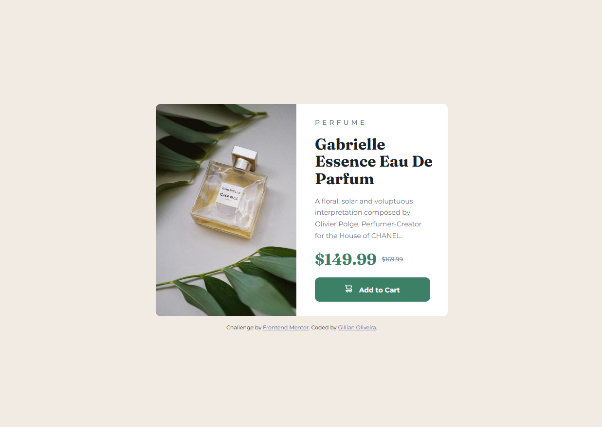

# Frontend Mentor - Product preview card component solution

This is a solution to the [Product preview card component challenge on Frontend Mentor](https://www.frontendmentor.io/challenges/product-preview-card-component-GO7UmttRfa). Frontend Mentor challenges help you improve your coding skills by building realistic projects.

## Table of contents

- [Frontend Mentor - Product preview card component solution](#frontend-mentor---product-preview-card-component-solution)
  - [Table of contents](#table-of-contents)
  - [Overview](#overview)
    - [The challenge](#the-challenge)
    - [Screenshot](#screenshot)
    - [Links](#links)
  - [My process](#my-process)
    - [Built with](#built-with)
    - [What I learned](#what-i-learned)
  - [Author](#author)
  - [Acknowledgments](#acknowledgments)

## Overview

### The challenge

Users should be able to:

- View the optimal layout depending on their device's screen size
- See hover and focus states for interactive elements

### Screenshot

Expected result:

Result achieved:

### Links

- Solution URL: [Product preview card component Repo](https://github.com/lia-oliveira/fm-product-preview-card-component)
- Live Site URL: [Product preview card component Live](https://fm-product-preview-card-component-theta.vercel.app/)

## My process

### Built with

- Semantic HTML5 markup
- CSS custom properties
- Flexbox
- CSS Grid
- Mobile-first workflow
- CSS Variables
- BEM

### What I learned
1. When using Google Fonts in an HTML file, if I’m working with font variables, there’s no need to use the classes provided by Google Fonts.
2. Since the default font size for this project is 14px, I set the root font size to 10px using a percentage to simplify converting pixel values to rem.
3. I used BEM for the first time in this project. Since it was small and relatively simple, I took the opportunity to learn this methodology. Initially, I found it verbose, but it made the code much easier to read. I now plan to learn more about it and apply it to future projects.

## Author

- Website - [Github](https://github.com/lia-oliveira)
- Frontend Mentor - [@lia-oliveira](https://www.frontendmentor.io/profile/lia-oliveira)

## Acknowledgments

I’d like to thank [Jye Harry](https://www.frontendmentor.io/profile/jyeharry), a Front-end Mentor user, for providing very constructive feedback on the Recipe Page project and introducing me to BEM.